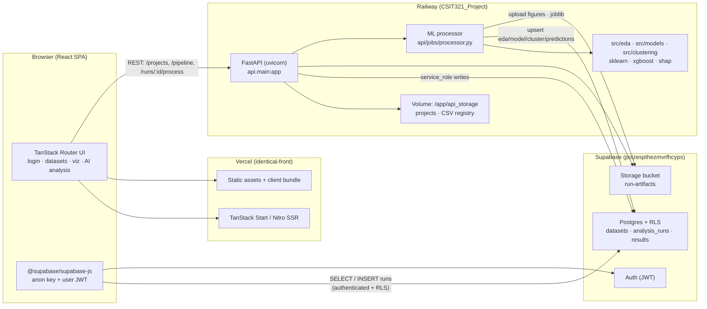

# Lotus — System architecture

> **Browser → Vercel → Railway API → Supabase → ML processor**

Production URLs:

| Layer | URL |
|-------|-----|
| Frontend | https://identical-front.vercel.app |
| API | https://vivacious-wisdom-production.up.railway.app |
| Database / Auth / Storage | https://poizespthezmvrfhcyps.supabase.co |

Deploy details: [`DEPLOY.md`](./DEPLOY.md). Security: [`CSIT321_Project/SECURITY.md`](../UniProjects/CSIT321_Project/SECURITY.md).

---

## Diagram



---

## Layer responsibilities

### 1. Browser (React + TanStack Start)

- **Repo:** `identical-front`
- **Routes:** `/login`, `/` (home), `/datasets`, `/visualisation`, `/ai-analysis`, `/runs/:runId`
- Reads/writes **analysis metadata** via Supabase client (`datasets`, `analysis_runs`, result tables) using the **anon key** and user session.
- Calls the **Lotus API** for projects (disk-backed), pipeline preview, and `POST /runs/{id}/process`.
- Never sees `SUPABASE_SERVICE_ROLE_KEY`.

### 2. Vercel (frontend host)

- Builds and serves the TanStack Start app (Nitro + Vercel preset).
- Injects public env vars at build time: `VITE_API_BASE_URL`, `VITE_SUPABASE_URL`, `VITE_SUPABASE_ANON_KEY`.
- Preview URLs per PR; CORS on the API must allow `*.vercel.app`.

### 3. Railway (FastAPI + ML worker)

- **Repo:** `CSIT321_Project`
- **Entry:** `uvicorn api.main:app` (Docker via `api/Dockerfile`, `railway.toml`)
- **Projects:** stored on a persistent volume at `STORAGE_DIR` (`/app/api_storage`) — not in Postgres.
- **Processor:** `api/jobs/processor.py` loads cohort CSV, applies cohort filters, runs EDA → models → clustering, writes results to Supabase with **service role** (bypasses RLS on result tables).
- Typical run duration: **~8 seconds** on Railway.

### 4. Supabase (auth + data + artefacts)

- **Postgres:** canonical IDs for datasets and runs (demo seed in `supabase/seed.sql`).
- **RLS:** open-read for authenticated users on demo tables; SPA cannot write to result tables directly.
- **Auth:** email/password, JWT access + refresh tokens.
- **Storage:** `run-artifacts` bucket for figures and model binaries.

---

## Key request flows

### Login

```
Browser → Supabase Auth (signInWithPassword)
       → JWT stored in SPA session
       → Subsequent Supabase queries carry user JWT (RLS applies)
```

### List projects (home)

```
Browser → GET https://vivacious-wisdom-production.up.railway.app/projects
       → FastAPI reads api_storage/projects.json (volume)
       → Returns eAsia demo project e1111111-…
```

### Create & process a run

```
Browser → INSERT analysis_runs (Supabase, anon + user JWT)
       → POST /runs/{id}/process (Railway API)
       → processor.py:
            load CSV (local registry or Supabase Storage)
            run_eda / run_models / run_clustering
            upsert eda_results, model_results, cluster_results, analysis_predictions
            upload artefacts to Storage
       → Browser polls /runs/{id} or navigates to results page
```

### View seeded demo run (no ML)

```
Browser → GET run + joined results from Supabase (RLS read)
       → /runs/bbbbbbbb-0000-0000-0000-000000000002
```

---

## Data split: what lives where

| Data | Store | Demo ID |
|------|-------|---------|
| Project name, pipeline steps, chart drafts | Railway volume (`api_storage`) | `e1111111-0000-0000-0000-000000000001` |
| Dataset metadata | Supabase `datasets` | `510a6e3f-2a6f-4824-99f6-f2cf6efbabeb` |
| Run config + status | Supabase `analysis_runs` | `bbbbbbbb-0000-0000-0000-000000000002` |
| EDA / model / cluster / predictions | Supabase result tables | same run ID |
| Figures & joblib files | Supabase Storage | `run-artifacts/{run_id}/…` |
| Raw CSV files | API local registry +/or Storage | registered at deploy seed |

---

## Local development (same architecture, different hosts)

```
localhost:8080  (npm run dev)  →  localhost:8000  (uvicorn)
                               →  Supabase cloud or local stack
```

One-command stack: `./scripts/dev-stack.sh` from `identical-front`.

---

## Known limitations

1. **`function_mode` not enforced server-side** — UI writes `full` / `prediction_only` / `subgroup_only` / `labels_only` to `analysis_runs`, but `processor.py` always runs the full pipeline. See [`DEMO.md`](./DEMO.md).
2. **Projects are not in Postgres** — only the API volume; Railway redeploy without volume loses projects unless re-seeded.
3. **Open-read RLS** — any authenticated user can read all demo runs; tighten before multi-tenant production.

---

## Related docs

- [`DEPLOY.md`](./DEPLOY.md) — env vars, Railway volume seed, Supabase seed, CORS
- [`DEMO.md`](./DEMO.md) — 5-minute walkthrough
- [`COMPLIANCE.md`](./COMPLIANCE.md) — judges talking points
- [`CSIT321_Project/SECURITY.md`](../UniProjects/CSIT321_Project/SECURITY.md) — RLS policies and service role
